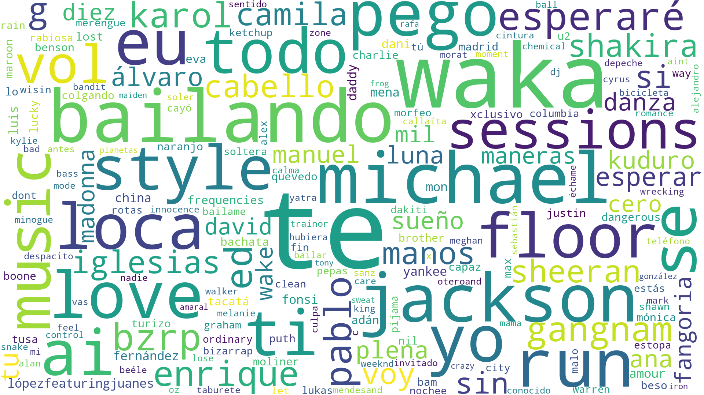

# PAC 2 - Visualització de Dades

Aquest document proporciona una explicació detallada de les tres tècniques de visualització implementades per al treball final: **Tag Cloud / Word Cloud**, **Proportional Symbol Map** i **Rose Chart**. S'inclouen definicions generals, tipus i estructures de dades adequades, descripcions de les pràctiques realitzades i comentaris breus sobre cada visualització.

---

## 1. Tag Cloud / Word Cloud

### Definició general

**Nom:** Tag Cloud o Word Cloud (Núvol de paraules)

**Origen:** Les Tag Clouds van sorgir a principis dels anys 2000 com a mètode per visualitzar les temàtiques principals de blogs i pàgines web. Es van popularitzar ràpidament com a eina per resumir grans volums de text de manera visual i intuïtiva.

**Funcionament:** Una Word Cloud és una representació visual de text on la mida de cada paraula és proporcional a la seva freqüència d'aparició en el corpus analitzat. Les paraules més freqüents apareixen amb una mida major, mentre que les menys freqüents són més petites. La disposició de les paraules pot ser aleatòria o organitzada, i el color pot utilitzar-se per categoritzar o simplement per millorar l'estètica de la visualització.

**Aplicacions típiques:**
- Anàlisi de sentiments en xarxes socials
- Identificació de temes principals en corpus de text
- Visualització de paraules clau en articles, discursos o documents
- Comparació de vocabulari entre diferents grups o períodes temporals
- Anàlisi de lletres de cançons o textos literaris

**Fonts de referència:**
- [DataViz Catalogue - Word Cloud](https://datavizcatalogue.com/ES/metodos/nube_de_palabras.html)
- [Data to Viz - Word Cloud](https://www.data-to-viz.com/graph/wordcloud.html)

### Tipus i estructura de dades adequades

**Tipus de dades:** Dades textuals qualitatives no estructurades. Les dades poden ser:
- Text pla (articles, discursos, comentaris)
- Llista de paraules amb freqüències associades
- Documents estructurats que continguin camps de text

**Estructura de dades:** 
- Format d'entrada: Text brut o CSV amb paraules i freqüències
- Processament necessari: Eliminació de paraules comunes (stopwords), normalització (minúscules), tokenització

**Requisits específics:**
- El text ha de contenir suficients paraules significatives per generar una visualització informativa
- És recomanable tenir un mínim de 50-100 paraules úniques després de la neteja
- No hi ha un límit màxim estricte, però conjunts molt grans (>10.000 paraules úniques) poden generar visualitzacions difícils de llegir

**Limitacions:**
- Conjunts de dades molt petits (<20 paraules úniques) no generen visualitzacions significatives
- Conjunts molt grans poden generar sobrecàrrega visual
- Les paraules molt llargues poden distorsionar la visualització
- La disposició aleatòria pot fer que paraules importants quedin ocultes

### Realització pràctica

**Dades utilitzades:** S'ha utilitzat un conjunt de dades de cançons número 1 a Espanya entre els anys 2000 i 2025, extretes de la pàgina de Wikipedia "List of number-one singles of 2025 (Spain)". Les dades inclouen els títols de les cançons, artistes i informació temporal.

**Eines utilitzades:** 
- Python amb les llibreries `wordcloud`, `pandas`, `matplotlib` i `beautifulsoup4`
- Notebook Jupyter per a l'exploració i processament de dades

**Procés realitzat:**
1. Extracció de dades de la pàgina web de Wikipedia
2. Processament i neteja del text (eliminació de stopwords, normalització)
3. Generació de múltiples word clouds per a diferents períodes temporals (2000-2025, 2008-2025, 2010-2025, 2025)
4. Visualització dels resultats amb diferents configuracions de color i estil

**Fitxers generats:**
- `spain_top1_2000_2025_wordcloud.png`
- `spain_top1_2008_2025_wordcloud.png`
- `spain_top1_2010_2025_wordcloud.png`
- `spain_top1_2025_wordcloud.png`
- `spain_top1_2000_2025_artists_wordcloud.png`

### Enllaç a la visualització

**URL de la visualització publicada:** [Enllaç a la Word Cloud](https://github.com/adriagonzalez-uoc/PAC-2-Visualitzacio-Dades/blob/main/word-cloud/topsogns/visualizations/spain_top1_2000_2025_wordcloud.png)

**Visualització:**

### Comentari sobre la visualització

**Què representa:** La visualització mostra les paraules més freqüents en els títols de les cançons número 1 a Espanya durant diferents períodes. La mida de cada paraula és proporcional a la seva freqüència d'aparició en els títols analitzats.

**Aspectes concrets ressaltats:**
- Identificació de temes recurrents en la música popular espanyola
- Evolució del vocabulari utilitzat en els títols al llarg del temps
- Comparació entre diferents períodes per observar canvis en les tendències musicals
- Diferències entre paraules en títols de cançons i noms d'artistes

**Objectiu de comunicació o descobriment:**
L'objectiu principal és descobrir quins són els temes, paraules i conceptes més recurrents en la música que arriba al número 1 a Espanya. Aquesta anàlisi permet:
- Entendre les tendències culturals i lingüístiques en la música popular
- Identificar paraules clau que caracteritzen els èxits musicals
- Observar l'evolució temporal del vocabulari utilitzat

**Justificació de la tècnica i les dades:**
La Word Cloud és ideal per a aquest objectiu perquè permet una comprensió ràpida i visual de les paraules més importants sense necessitat de llegir llistes llargues de freqüències. Les dades de cançons número 1 són adequades perquè representen un corpus significatiu i representatiu de la música popular, i els títols són textos curts però informatius que es presten perfectament a aquest tipus d'anàlisi.

---

## 2. Proportional Symbol Map (Mapa de Símbols Proporcionals)

### Definició general

**Nom:** Proportional Symbol Map o Mapa de Símbols Proporcionals (també conegut com a Pie Chart Map quan combina símbols proporcionals amb gràfics de pastís)

**Origen:** Els mapes de símbols proporcionals tenen els seus orígens en la cartografia temàtica del segle XIX, quan es van començar a utilitzar símbols de mida variable per representar dades quantitatives en mapes. La combinació amb gràfics de pastís (pie charts) és una evolució més recent que permet representar múltiples dimensions simultàniament.

**Funcionament:** Aquest tipus de mapa combina tres elements:
1. **Mapa geogràfic base:** Mostra la localització de les àrees d'interès (ciutats, províncies, regions)
2. **Símbols proporcionals:** Cercles (o altres formes) on la mida és proporcional a una variable quantitativa (p. ex., total de vots)
3. **Gràfics de pastís:** Dins de cada símbol, es mostren les proporcions de diferents categories (p. ex., percentatge de vots per partit)

Això crea una visualització multidimensional que mostra simultàniament: **on** (ubicació geogràfica), **quant** (mida del símbol) i **com** (distribució proporcional).

**Aplicacions típiques:**
- Visualització de resultats electorals per territori
- Distribució de població o recursos per regió
- Anàlisi de dades de vendes o negocis per ubicació
- Representació de dades demogràfiques o socials geolocalitzades
- Anàlisi de dades de salut pública per àrea geogràfica

**Fonts de referència:**
- [SAGE Research Methods - Proportional Symbol Map](https://methods.sagepub.com/chart/proportional-symbol-map)
- [DataViz Project - Pie Chart Map](https://datavizproject.com/data-type/pie-chart-map/)

### Tipus i estructura de dades adequades

**Tipus de dades:** 
- **Quantitatives:** Valors numèrics per a la mida dels símbols (p. ex., total de vots, població)
- **Categòriques:** Categories per als segments del gràfic de pastís (p. ex., partits polítics, tipus de producte)
- **Geoespacials:** Coordenades geogràfiques (latitud/longitud) o identificadors geogràfics (noms de municipis, codis postals)

**Estructura de dades:**
- Taula amb columnes per a:
  - Identificador geogràfic (nom del municipi, codi, etc.)
  - Coordenades geogràfiques (latitud, longitud) o capacitat de geocodificació
  - Variable quantitativa principal (per a la mida del símbol)
  - Variables categòriques amb valors numèrics (per als segments del pastís)

**Requisits específics:**
- **Mida mínima del conjunt de dades:** Mínim 5-10 ubicacions per generar una visualització significativa
- **Mida màxima:** Depèn de la resolució del mapa, però generalment es recomana no superar 200-300 ubicacions per evitar sobrecàrrega visual
- Les coordenades han de ser precises per evitar errors de posicionament
- La variable quantitativa ha de tenir variació suficient per apreciar diferències en les mides

**Limitacions:**
- Símbols molt grans poden sobreposar-se i dificultar la lectura
- Diferències molt petites en valors poden ser difícils de percebre visualment
- Requereix dades geogràfiques precises (coordenades o capacitat de geocodificació)
- Amb moltes categories en el gràfic de pastís, els segments poden ser massa petits per llegir

### Realització pràctica

**Dades utilitzades:** S'han utilitzat dades de les eleccions municipals de Catalunya de 2019, obtingudes de fonts de dades obertes. Les dades inclouen:
- Nom del municipi
- Coordenades geogràfiques (latitud i longitud)
- Vots totals per municipi
- Distribució de vots per partit polític

**Eines utilitzades:**
- Python amb les llibreries `folium` (per a mapes interactius), `pandas`, `geopandas` i `matplotlib`
- Notebook Jupyter per a l'exploració, processament i visualització de dades

**Procés realitzat:**
1. Càrrega i neteja de les dades electorals
2. Geocodificació de municipis per obtenir coordenades (quan no estaven disponibles)
3. Preparació de les dades per a la visualització (agregació de vots per partit, càlcul de percentatges)
4. Creació del mapa interactiu amb Folium, on cada municipi està representat per:
   - Un cercle de mida proporcional al total de vots
   - Un gràfic de pastís dins del cercle mostrant la distribució de vots per partit
5. Generació de múltiples versions del mapa (tots els municipis, top 50, etc.)

**Fitxers generats:**
- `proportional_symbol_map_catalonia.html` (versió interactiva amb tots els municipis)
- `proportional_symbol_map_catalonia_top50.html` (versió amb els 50 municipis amb més vots)
- `proportional_symbol_map_catalonia_all.html` (versió completa)

### Enllaç a la visualització

**URL de la visualització publicada:** [Enllaç al Mapa de Símbols Proporcionals](https://adriagonzalez-uoc.github.io/PAC-2-Visualitzacio-Dades/)

**Visualització Generades:**
- [Mapa complet de Catalunya](proportional%20symbol%20map/proportional_symbol_map_catalonia.html)
- [Top 50 municipis](proportional%20symbol%20map/proportional_symbol_map_catalonia_top50.html)

### Comentari sobre la visualització

**Què representa:** La visualització mostra els resultats de les eleccions municipals de Catalunya de 2019, on cada municipi està representat per un símbol circular. La mida del cercle és proporcional al total de vots emesos en aquell municipi, i dins de cada cercle hi ha un gràfic de pastís que mostra la distribució percentual de vots per partit polític.

**Aspectes concrets ressaltats:**
- Distribució geogràfica de la participació electoral (municipis amb més/menys participació)
- Patrons geogràfics en les preferències polítiques (concentració de suport per partit en certes àrees)
- Comparació visual de la magnitud electoral entre diferents municipis
- Identificació de municipis amb distribució de vots equilibrada vs. municipis amb majoria clara d'un partit
- Relació entre mida del municipi (en termes de participació) i preferències polítiques

**Objectiu de comunicació o descobriment:**
L'objectiu principal és proporcionar una comprensió ràpida i visual de la geografia electoral de Catalunya, permetent identificar:
- On es concentren els vots (municipis amb major participació)
- Com es distribueixen les preferències polítiques geogràficament
- Relacions entre la mida dels municipis i les seves preferències polítiques
- Patrons regionals en el comportament electoral

**Justificació de la tècnica i les dades:**
El Proportional Symbol Map amb gràfics de pastís és ideal per a aquest objectiu perquè permet representar simultàniament tres dimensions de les dades electorals: la ubicació geogràfica, la magnitud (total de vots) i la composició (distribució per partit). Això és impossible d'aconseguir amb un gràfic tradicional. Les dades electorals són perfectes per a aquesta tècnica perquè són inherentment geogràfiques (cada vot està associat a un municipi) i tenen múltiples dimensions quantitatives i categòriques que es poden visualitzar simultàniament. La tècnica permet als usuaris identificar ràpidament patrons geogràfics que serien difícils de detectar en taules de dades.

---

## 3. Rose Chart (Diagrama de Rosa / Wind Rose)

### Definició general

**Nom:** Rose Chart, també conegut com a Wind Rose (Rosa dels Vents), Polar Area Chart, Coxcomb Chart o Nightingale Rose Chart

**Origen:** Aquest tipus de gràfic té una història rica. El terme "Wind Rose" s'utilitza des de fa segles en navegació per mostrar la direcció del vent. El format modern va ser popularitzat per Florence Nightingale al segle XIX quan va crear els seus famosos "Coxcomb Charts" per visualitzar les causes de mortalitat durant la Guerra de Crimea. Nightingale va utilitzar aquests gràfics per comunicar efectivament dades estadístiques a polítics i líders militars.

**Funcionament:** Un Rose Chart és un gràfic circular dibuixat en coordenades polars. Cada categoria o interval es divideix en sectors iguals al voltant d'un cercle central. La distància des del centre fins a la vora de cada sector és proporcional al valor que representa. A diferència d'un gràfic de pastís tradicional, on l'àrea del sector és proporcional al valor, en un Rose Chart el radi (distància des del centre) és proporcional al valor, fet que fa que els sectors exteriors tinguin una àrea desproporcionadament gran. Això pot ser una limitació, però també permet destacar millor les diferències en valors grans.

**Aplicacions típiques:**
- Meteorologia: distribució de direcció i velocitat del vent (aplicació clàssica)
- Anàlisi de dades cícliques: hores del dia, mesos de l'any, direccions
- Dades estacionals: patrons que es repeteixen en cicles
- Anàlisi de trànsit: volum de trànsit per hora del dia o direcció
- Dades esportives: distribució de tirades o gols per angle
- Dades econòmiques: vendes o activitat per mes o estació

**Fonts de referència:**
- [InetSoft - Wind Rose Charts Definition](https://www.inetsoft.com/info/wind-rose-charts-definition-example/)
- [DataViz Catalogue - Polar Area Chart](https://datavizproject.com/data-type/polar-area-chart/)

### Tipus i estructura de dades adequades

**Tipus de dades:**
- **Quantitatives:** Valors numèrics que es volen comparar entre categories
- **Categòriques amb estructura cíclica:** Categories que tenen una naturalesa circular o direccional (direccions del vent, hores del dia, mesos, angles)

**Estructura de dades:**
- Taula amb dues columnes principals:
  - Columna categòrica: Categories o intervals (p. ex., direccions: N, NE, E, SE, S, SW, W, NW)
  - Columna quantitativa: Valors numèrics associats a cada categoria (p. ex., freqüència, velocitat mitjana, total)
- Opcionalment, es poden tenir múltiples variables quantitatives per crear gràfics apilats

**Requisits específics:**
- **Mida mínima:** Mínim 4-8 categories per generar una visualització significativa (per exemple, les 8 direccions principals del vent)
- **Mida màxima:** Generalment es recomana no superar 36-72 categories per mantenir la llegibilitat (per exemple, 36 sectors de 10 graus cadascun per a direccions del vent)
- Les categories han de tenir una estructura cíclica o direccional natural
- Els valors han de ser no negatius (no es poden representar valors negatius amb aquesta tècnica)

**Limitacions:**
- Els sectors exteriors tenen una àrea desproporcionadament gran respecte als valors que representen (a causa de l'augment de l'àrea amb el radi)
- Amb moltes categories, el gràfic pot esdevenir difícil de llegir
- No és adequat per a valors negatius
- La comparació precisa de valors pot ser difícil a causa de la distorsió de l'àrea
- Requereix que les dades tinguin una naturalesa cíclica o direccional

### Realització pràctica

**Dades utilitzades:** S'han utilitzat dades meteorològiques de l'Iowa Environmental Mesonet, específicament dades de vent de l'estació Central Wisconsin Airport (CWA) del sistema Wisconsin Automated Surface Observing System (WI_ASOS). Les dades cobreixen el període des de 1970 fins a 2025 i inclouen:
- Direcció del vent dividida en 36 sectors (10 graus per sector)
- Distribució de freqüències de velocitat del vent en diferents intervals (Calm, 2.0-4.9 mph, 5.0-6.9 mph, 7.0-9.9 mph, 10.0-14.9 mph, 15.0-19.9 mph, 20.0+ mph)
- Dades agregades per mes (en aquest cas, gener)

**Eines utilitzades:**
- Python amb les llibreries `matplotlib`, `pandas`, `numpy` i `urllib` per a la descàrrega de dades
- Notebook Jupyter per a l'exploració, processament i visualització

**Procés realitzat:**
1. Descàrrega de dades des de l'API de l'Iowa Environmental Mesonet
2. Processament i neteja de les dades (conversió de format, càlcul d'angles en radians)
3. Creació del gràfic de rosa utilitzant coordenades polars de matplotlib
4. Visualització de la distribució de velocitats del vent per direcció, on:
   - Cada sector radial representa una direcció del vent (10 graus)
   - Dins de cada sector, es mostren barres apilades que representen diferents intervals de velocitat
   - El color indica l'interval de velocitat del vent
5. Generació del gràfic final amb llegenda i etiquetes

**Fitxers generats:**
- `wind_rose_plot.png` (gràfic de rosa dels vents)
- `wind_rose_data.csv` (dades processades)

### Enllaç a la visualització

**URL de la visualització publicada:** [Enllaç al Rose Chart](https://github.com/adriagonzalez-uoc/PAC-2-Visualitzacio-Dades/blob/main/Rose%20Chart/wind%20rose/wind_rose_plot.png)

**Visualització:**

### Comentari sobre la visualització

**Què representa:** La visualització mostra la distribució de la direcció i velocitat del vent a l'estació meteorològica Central Wisconsin Airport durant el mes de gener, basada en dades històriques des de 1970. Cada sector radial representa una direcció del vent (dividida en intervals de 10 graus), i dins de cada sector, les barres apilades mostren la freqüència de diferents intervals de velocitat del vent, codificades per color.

**Aspectes concrets ressaltats:**
- Direccions predominants del vent durant el mes de gener
- Distribució de velocitats del vent per direcció
- Patrons estacionals (en aquest cas, específics del mes de gener)
- Relació entre direcció i intensitat del vent
- Identificació de direccions amb vents més forts o més febles

**Objectiu de comunicació o descobriment:**
L'objectiu principal és comprendre els patrons de vent en una ubicació específica, permetent:
- Identificar les direccions del vent més comunes
- Entendre la distribució de velocitats del vent per direcció
- Detectar patrons estacionals (com canvis entre mesos)
- Aplicacions pràctiques com planificació d'activitats a l'aire lliure, anàlisi per a energia eòlica, o comprensió del clima local

**Justificació de la tècnica i les dades:**
El Rose Chart (Wind Rose) és la tècnica clàssica i estàndard per visualitzar dades de vent precisament perquè les dades de vent tenen una naturalesa inherentment direccional i cíclica. La direcció del vent es mesura en graus (0-360°), formant un cicle complet, i la combinació de direcció i velocitat crea una estructura de dades multidimensional que es representa perfectament amb aquest format circular. Les dades meteorològiques són ideals perquè:
- Tenen una estructura cíclica natural (direccions del vent)
- Combinen múltiples dimensions (direcció, velocitat, freqüència)
- Són dades històriques riques que permeten anàlisis temporals
- Tenen aplicacions pràctiques clares

La tècnica permet als usuaris identificar ràpidament patrons que serien difícils de detectar en una taula de dades, com ara la relació entre direcció i intensitat del vent, o les direccions predominants en diferents estacions de l'any.

---

## Conclusió

Les tres tècniques de visualització implementades demostren la importància de seleccionar la tècnica adequada per al tipus de dades i l'objectiu de comunicació. Cada tècnica té les seves fortaleses i limitacions, i la seva efectivitat depèn de la naturalesa de les dades i del que es vol comunicar o descobrir. La Word Cloud és ideal per a dades textuals i identificació ràpida de temes, el Proportional Symbol Map combina perfectament dades geogràfiques amb múltiples dimensions quantitatives i categòriques, i el Rose Chart és la solució clàssica per a dades cícliques o direccionals com les dades meteorològiques.

